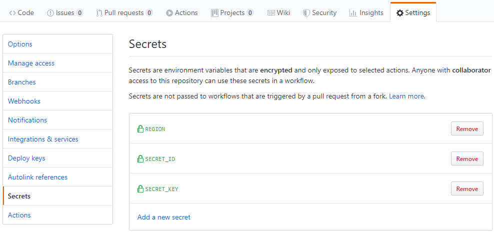

## 简介

该 [GitHub Action](https://help.github.com/cn/actions) 用于调用腾讯云 [COSCMD](https://github.com/tencentyun/coscmd) 工具，实现对象存储的批量上传、下载、删除等操作。

## workflow 示例

在目标仓库中创建 `.github/workflows/coscmd.yml` 即可，文件名任意，配置参考如下：

```yaml
name: COSCMD

on:
  push:
    branches:
      - master

jobs:
  build-deploy:
    runs-on: ubuntu-18.04

    steps:
      - uses: actions/checkout@v1
        with:
          submodules: true

      - name: Setup Hugo
        uses: peaceiris/actions-hugo@v2
        with:
          hugo-version: 'latest'
          extended: true

      - name: Build
        run: hugo --minify

      - name: Deploy Tencent Cloud COS
        uses: arcsinu/actions-coscmd@v1
        with:
          args: upload -rs --delete ./public/ / --ignore .git
          secret_id: ${{ secrets.SECRET_ID }}
          secret_key: ${{ secrets.SECRET_KEY }}
          bucket: ${{ secrets.BUCKET }}
          region: ${{ secrets.REGION }}
```

其中 `${{ secrets.SECRET_ID }}` 是调用在 Settings 配置的密钥，防止公开代码将权限密钥暴露。添加方式如下：



## 相关参数

以下参数均可参见 [COSCMD 官方文档](https://cloud.tencent.com/document/product/436/10976)

| 参数 | 必要 | 备注 |
| --- | --- | --- |
| ARGS | 是 | coscmd 命令参数，参见官方文档，多个命令用 ` && ` 隔开<br>如 `--help && --version` |
| SECRET_ID | 是 | 云 API 密钥 SecretId，前往 [API 密钥管理](https://console.cloud.tencent.com/cam/capi) 获取。 |
| SECRET_KEY | 是 |云 API 密钥 SecretKey，前往 [API 密钥管理](https://console.cloud.tencent.com/cam/capi) 获取。 |
| BUCKET | 是 | 对象存储桶的名称，包含后边的数字。 |
| REGION | 是 | 对象存储桶的地区，[参见文档](https://cloud.tencent.com/document/product/436/6224) |
